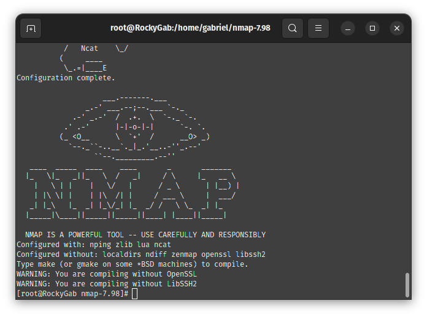

# Repo 2: Identity, Access & Cybersecurity 🛡️

Este repositório documenta a implementação de uma **Arquitetura de Defesa em Profundidade** utilizando o Rocky Linux 9. O objetivo foi transformar um servidor padrão em uma infraestrutura blindada, auditável e resiliente, focando em segurança operacional para o mercado brasileiro.

---

## Estrutura do Projeto
A organização deste repositório segue padrões de documentação profissional:
* `scripts/`: Automações de segurança e monitoramento.
* `docs/assets/`: Evidências técnicas de auditorias e logs.
* `config/`: Arquivos de configuração de serviços (Fail2Ban, Tripwire, etc).

---

## Implementações de Hardening & Evidências

### **1. Gestão de Identidade e Permissões (IAM)**
Controle rigoroso de quem acessa o quê, utilizando ferramentas nativas e avançadas.
* **[Controle de Acesso por ACLs](docs/assets/01-acl-configuration-getfacl.png):** Permissões granulares além do padrão Linux.
* **[Auditoria via Cockpit](docs/assets/iam-cockpit.png):** Monitoramento visual de usuários e logs de autenticação.
* **[Check de Usuários](docs/assets/user-audit-cli.png):** Validação de integridade de contas via terminal.

### **2. Integridade e Segurança de Dados (FIM)**
Garantindo a imutabilidade do sistema e proteção contra alterações indevidas.
* **[Integridade com Tripwire](docs/assets/tripwire-integrity-check-complete.png):** Monitoramento ativo de hashes de arquivos críticos.
* **[Blindagem com LUKS](docs/assets/luks-setup-complete.png):** Criptografia de disco para proteção de dados em repouso.
* **[Auditoria Lynis](docs/assets/lynis-hardening-index-68.png):** Pontuação de **68 no Hardening Index**, validando a robustez da máquina.

### **3. Defesa Ativa e Auditoria de Rede**
Blindagem das portas de entrada e monitoramento de ameaças em tempo real.
* **[Consolidação Técnica](docs/assets/auditoria-final-hardening.png):** SSH na porta 2222, rich rules de firewall e SELinux ativo.
* **[Jails do Fail2Ban](docs/assets/fail2ban-ssh-jail-active-status.png):** Proteção automática contra ataques de força bruta no SSH.
* **[Antivírus Systemd](docs/assets/clamav-automation-service.png):** Automação do ClamAV para defesa proativa.

---

## Diferenciais de Troubleshooting (Mão na Massa)

Demonstração de competências técnicas que vão além do básico:

1.  **Compilação Manual:** Instalação do **Nmap 7.98** a partir do código-fonte, garantindo ferramentas atualizadas sem depender apenas de repositórios oficiais.
    * 
2.  **Serviços Customizados:** Criação de um serviço Systemd para monitoramento de RAM em tempo real, integrando logs estruturados.
    * 
3.  **SELinux Resiliente:** Diferente da abordagem comum de desativar o SELinux, mantive-o ativo (Permissive) para aprender a diagnosticar e rotular contextos de arquivos corretamente.

---

## Insights & Metodologia
* **Segurança em Camadas:** A defesa não depende de uma ferramenta, mas da combinação de Firewall + SELinux + Tripwire.
* **Documentação como Código:** Cada passo foi documentado via terminal (Vim), garantindo rastreabilidade.
* **Foco em Estabilidade:** O hardening foi aplicado visando a segurança sem comprometer o tempo de atividade (*uptime*) do servidor.

---

## ⏭️ Próximos Passos
Concluída a segurança. Futura atualização somente para incluir SQLITE.
