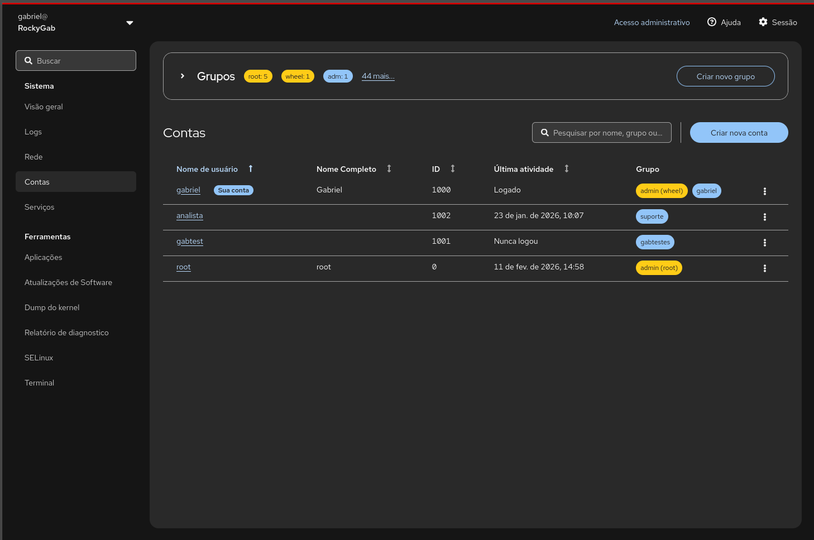
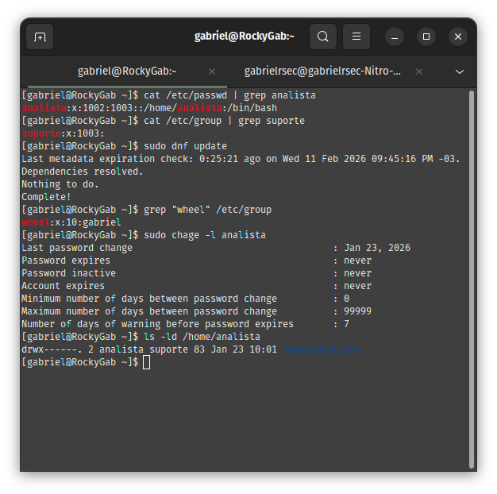
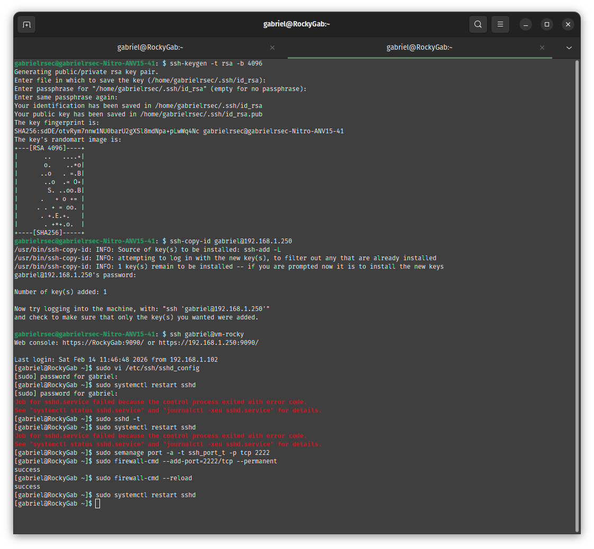
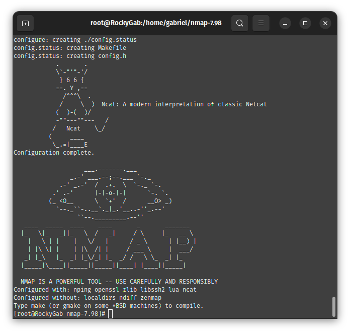

cat << 'EOF' > README.md
# Repo 2: Identity, Access & Cybersecurity 🛡️

Este repositório documenta minha jornada de aprendizado em **Segurança Operacional e Hardening**. Aqui, o foco deixa de ser apenas "fazer funcionar" e passa a ser "fazer de forma segura", aplicando o princípio do privilégio mínimo e a redução da superfície de ataque.

> **🎯 Perfil:** Entusiasta de Linux e Cibersegurança em busca de **Estágio/Oportunidade Júnior**. Este projeto demonstra minha disciplina com documentação técnica e atenção aos detalhes de infraestrutura corporativa.

---

## 🛠️ Laboratórios de Especialização

### **1. Identity & Access Management (IAM)**
Implementação de políticas de governança de usuários e grupos para garantir conformidade e rastreabilidade. Para equilibrar a gestão, utilizo tanto o monitoramento visual quanto a auditoria bruta via terminal.

*Legenda: Gestão centralizada de contas e monitoramento de logs via Cockpit.*

**Habilidades demonstradas:**
* **Auditoria CLI:** Validação de permissões, integridade de arquivos sensíveis e gestão de privilégios elevados. 
* **Compliance:** Configuração de políticas de senhas e expiração de contas (Password Aging).
* **Evidência Extra:** [Ajuste de Runlevels e Targets do Sistema](docs/assets/hardening-target-configuration.png).

---

### **2. SSH Hardening & SELinux (Segurança de Infraestrutura)**
Configuração crítica do serviço SSH para mitigar vetores de ataque comuns e gestão de políticas de segurança no nível do Kernel.

*Legenda: Ajustando contextos do SELinux para permitir serviços customizados sem abrir mão da segurança.*

> **🔐 Nota de Hardening (SELinux States):**
> Durante este lab, apliquei a diferença entre **Enforcing** (bloqueio ativo), **Permissive** (diagnóstico) e **Disabled** (inseguro). O objetivo foi manter o sistema sempre em modo Enforcing, corrigindo as políticas conforme necessário.

**Habilidades demonstradas:**
* **Blindagem de Acesso:** [Configuração final do SSHD](docs/assets/sshd-config-hardening-final.png) (Desativação de login root, porta não-padrão e criptografia forte).
* **Service Control:** [Uso de Masking em serviços inseguros e configuração de IPtables](docs/assets/hardening-service-masking-iptables.png).

---

### **3. Auditoria de Rede e Inteligência**
Mapeamento de serviços e portas para detecção de vulnerabilidades. Este laboratório destaca minha proatividade em trabalhar com ferramentas atualizadas.

*Legenda: Auditoria com Nmap v7.98 (Compilado manualmente com suporte a OpenSSL e LibSSH2).*

**Diferencial Técnico:**
- **Source Compilation:** Domínio de compilação de software para garantir suporte a protocolos modernos de segurança (SSL/TLS).
- **Network Discovery:** Análise de superfícies de exposição em ambientes Rocky Linux.

---

## 🏆 Desafios Técnicos Superados

Ao longo deste repositório, enfrentei e resolvi obstáculos que demonstram minha resiliência técnica:

1. **Persistência do SELinux:** Ao alterar a porta do SSH, o serviço foi bloqueado pelo Kernel. Em vez de desabilitar a segurança, utilizei o `semanage` para criar uma política que permitisse a nova porta, mantendo o sistema blindado.
2. **Automação de Serviços:** Superei erros de execução no Systemd ao configurar serviços de monitoramento, aprendendo a trabalhar com caminhos absolutos e gestão de permissões em `/var/log`.
3. **Gestão de Dependências:** A compilação manual do Nmap exigiu a resolução de dependências críticas de desenvolvimento, garantindo uma ferramenta de auditoria superior à versão padrão dos repositórios.

---

## ✍️ Metodologia e Workflow
Documentar é tão importante quanto executar. Utilizo o terminal como minha principal IDE de trabalho.

* **[Vim como IDE de Documentação](docs/assets/documentation-workflow-vim.png)**: Edição ágil e direta no servidor.
* **[Organização de Repositório](docs/assets/projeto-estrutura-git.png)**: Estrutura profissional para escalabilidade.
* **[Ciclo de Vida Git](docs/assets/evidencia-deploy-local.png)**: Versionamento rigoroso para garantir a integridade do código.

---

## 🚀 Contato
Estou pronto para aprender e contribuir em times de infraestrutura e segurança. Sinta-se à vontade para revisar meus laboratórios!
EOF

echo "✅ README.md do Repo 2 atualizado com sucesso!"
