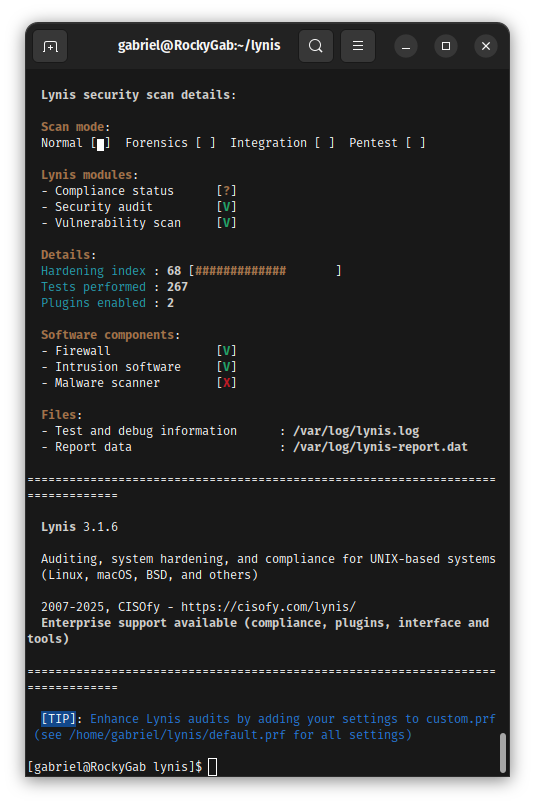
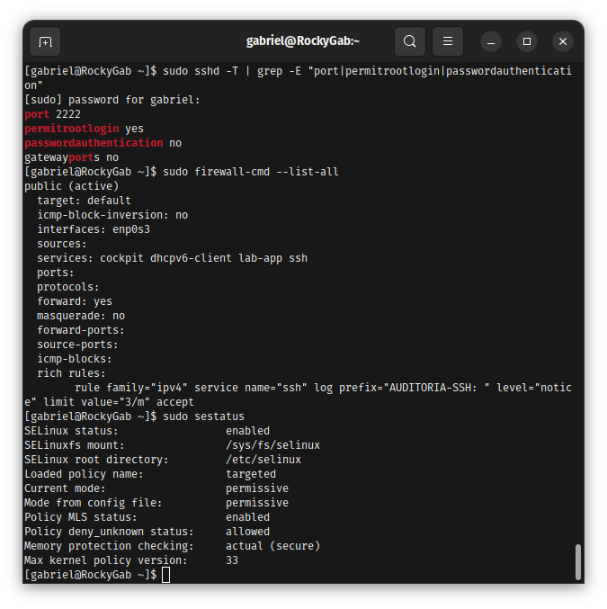

# Repo 2: Identity, Access & Cybersecurity 🛡️

Este repositório documenta a blindagem de um servidor Rocky Linux 9, transformando-o em uma infraestrutura resiliente e auditável. O foco foi a implementação de camadas de defesa em profundidade para proteção de dados e controle de acesso.

---

## Resumo do Hardening (Resultados Reais)

Aqui estão os pilares de segurança implementados. Clique para ver os detalhes técnicos de cada camada.

<b> 1. Gestão de Identidade (IAM)</b>

* Implementação de ACLs para controle granular de arquivos.
* Auditoria de sessões de usuários para rastreabilidade total.
* **Evidência principal:** 

<b> 2. Integridade e Proteção de Dados (FIM)</b>

* Configuração de **Tripwire** para detecção de intrusão e alteração de arquivos críticos.
* Criptografia de disco via **LUKS** para segurança em repouso.
* **Status final:** 

<b> 3. Defesa de Perímetro e Rede</b>

* SSH blindado na porta 2222 e bloqueio de força bruta com **Fail2Ban**.
* Regras ricas de Firewall com logging ativo para auditoria de ataques.
* **Configuração ativa:** 

---

## Diferenciais Técnicos (SRE & Troubleshooting)

Para este projeto, não utilizei apenas instaladores automáticos; trabalhei na base do sistema para garantir flexibilidade:

### **Compilação Manual (Nmap 7.98)**
Domínio sobre o ciclo de vida de softwares, compilando ferramentas direto do código-fonte para maior segurança e controle de dependências.

### **Automação via Systemd**
Criação de serviços customizados para monitoramento de recursos (RAM e Logs), garantindo visibilidade total do ambiente.

---

## Metodologia Prática
* **SELinux Proativo:** Mantive o SELinux em modo *Permissive* para mapear contextos e criar políticas reais, em vez de simplesmente desativar a segurança.
* **Vim as IDE:** Todo o setup foi documentado e editado via terminal, demonstrando agilidade em ambientes sem interface gráfica.

---

## ⏭️ Próximos Passos
Concluída a segurança. Futura atualização somente para incluir SQLite.

---

  <b>[<a href="docs/assets/">Clique aqui para ver a Galeria Completa de Evidências Técnicas</a>]</b>

