# Linux Lab: Identity, Access & Cybersecurity 🛡️
> Hardening de sistemas RHEL-based, gestão de identidades (IAM) e defesa em profundidade.

| Categoria | Tecnologias | Status |
| :--- | :--- | :--- |
| **Segurança** | SELinux (Permissive), Tripwire | ✅ Stable |
| **Firewall** | Firewalld (Rich Rules), Fail2Ban | ✅ Ativo |
| **Criptografia** | LUKS (Data-at-Rest) | ✅ Implementado |
| **Auditoria** | Lynis (Hardening Index: 68) | ✅ Auditado |

---

## 🎯 Objetivo Técnico
Transformar um servidor padrão em uma infraestrutura resiliente e auditável, aplicando camadas de defesa em profundidade para proteção de dados e controle de acesso granular.

---

## 🛠️ Troubleshooting & Engenharia de Segurança

### 1. Gestão de Identidade e Acesso (IAM)
Implementação de controle granular via Cockpit, auditoria de sessões e configuração de permissões avançadas (ACLs).
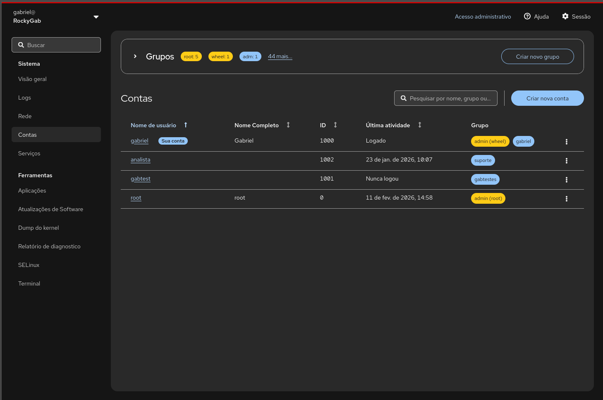
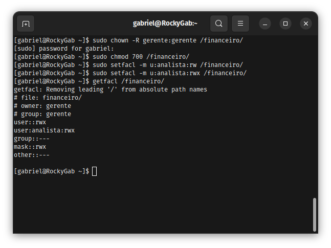
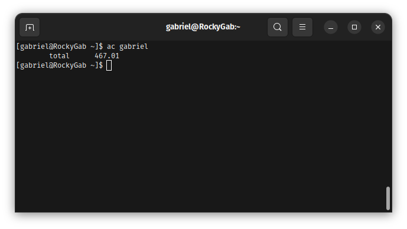

### 2. Integridade e Detecção de Intrusão (FIM & Antivírus)
Uso do **Tripwire** para monitoramento de arquivos críticos e deploy do **ClamAV** para proteção contra malwares.
* **Resultado:** Auditoria completa via Lynis com Hardening Index 69.
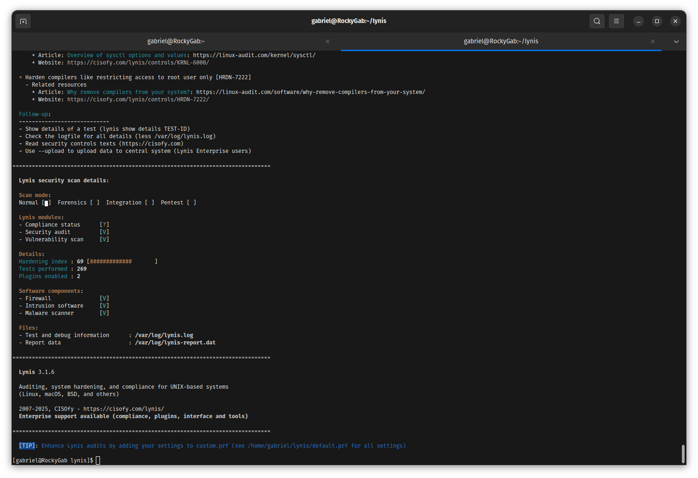
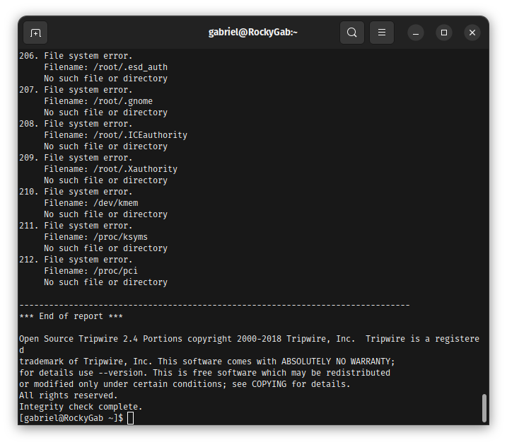
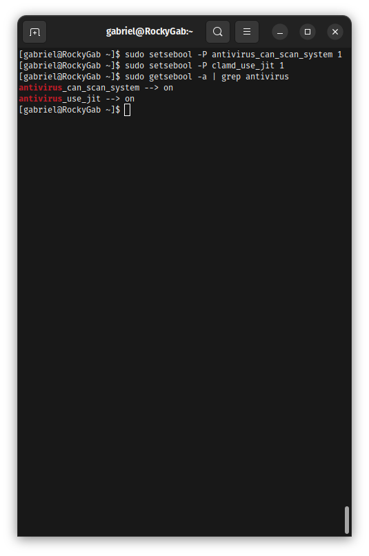

### 3. Defesa de Perímetro (Firewall & SSH)
Blindagem de SSH na porta 2222 e bloqueio de força bruta com **Fail2Ban**.
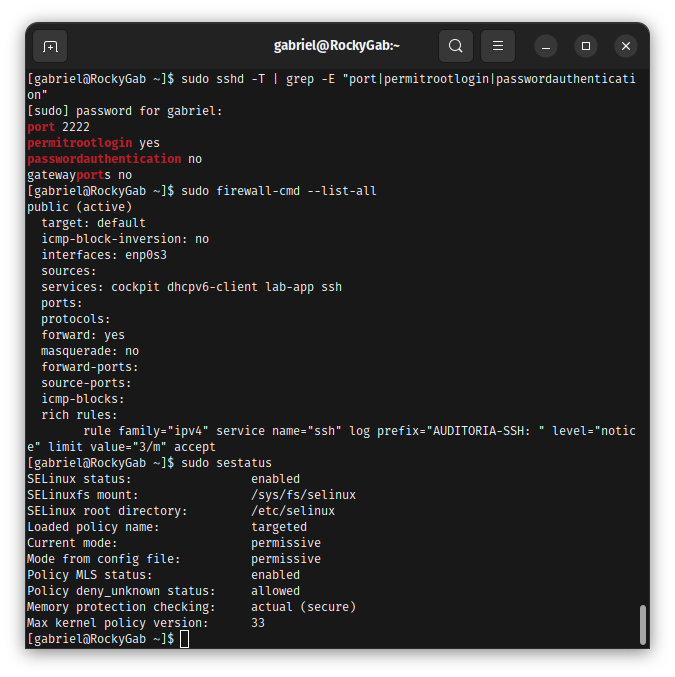
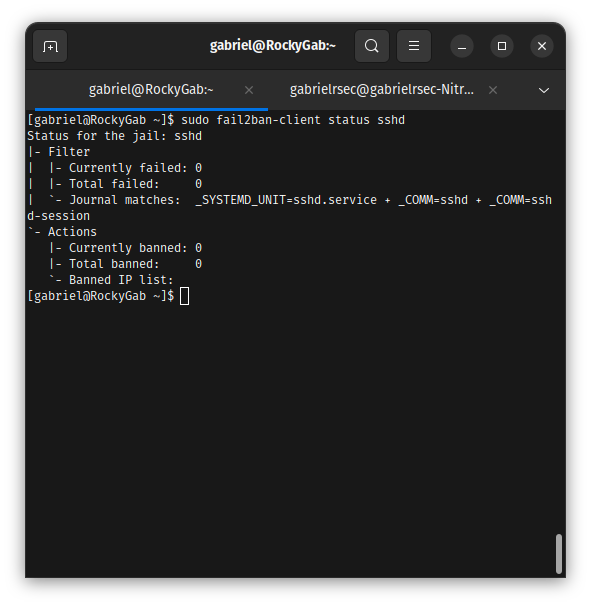

### 3.1. Defesa de Perímetro e Análise de Ofensiva (SOC Mindset)
Blindagem de SSH na porta 2222 e monitoramento ativo de tentativas de intrusão.

* **Hardening de Firewall:** Configuração de `firewalld` com Rich Rules para auditoria de tráfego e segmentação de portas.
* **Detecção de Brute Force:** Identificação em tempo real de tentativas de acesso via usuários inválidos e IPs externos.

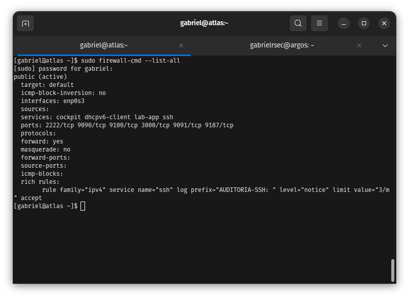
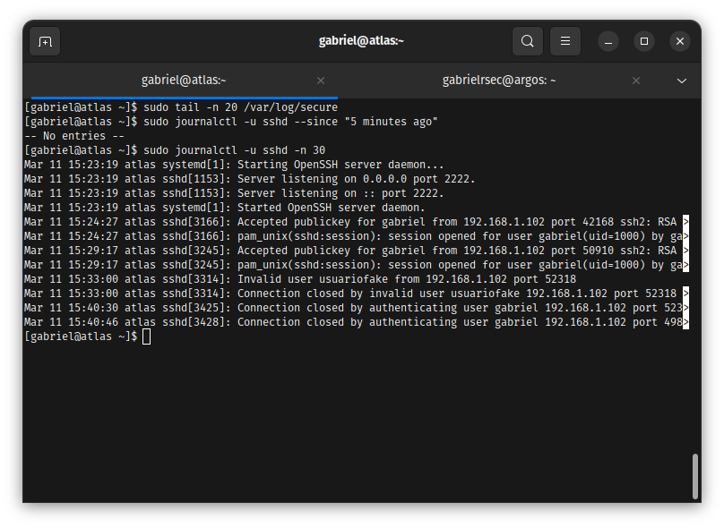

> **Nota Técnica:** O log acima demonstra a captura de um evento de força bruta (MITRE T1110) originado de uma rede externa, onde o sistema identificou o IP atacante e o usuário alvo, permitindo a correlação de dados para resposta a incidentes.

### 4. Resolução de Conflitos de Kernel (NVIDIA/CUDA)
* **Incidente:** Mismatch entre bibliotecas NVML e módulos de Kernel.
* **Solução:** Saneamento de repositórios e deploy do Driver 580 (Open Kernel).
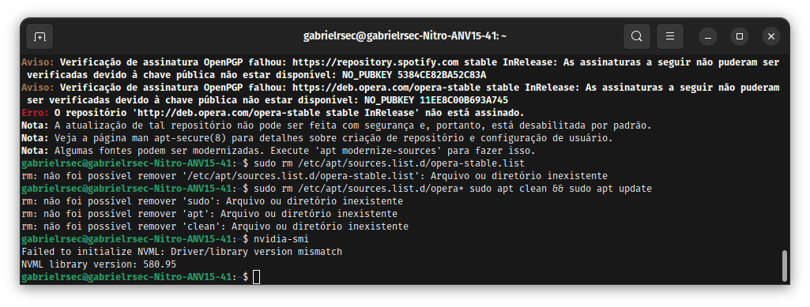
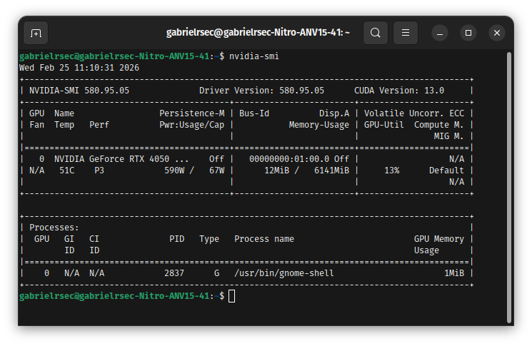

---

## Automação de Auditoria e Saúde (Toolkit)
Desenvolvimento de scripts para garantir a conformidade contínua do ambiente:

* **`security_audit.sh`**: Validação de SELinux, SSH e Firewalld.
* **`check_system_health.sh`**: Diagnóstico proativo de recursos.
* **`monitor_sistema.sh`**: Monitoramento de logs e processos.

**Evidência de Monitoramento:**

---

## 🛡️ Diferenciais de Operação (SRE Mindset)

* **Compilação Manual (Nmap 7.98):** Domínio do ciclo de vida de software, compilando binários direto da fonte para auditoria.
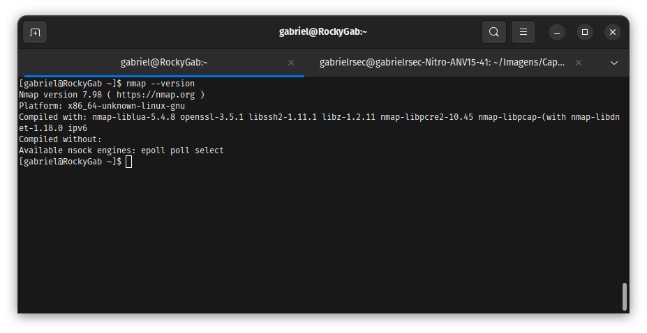
* **Hardening de Serviços:** Implementação de Masking em serviços desnecessários e tunelamento seguro.
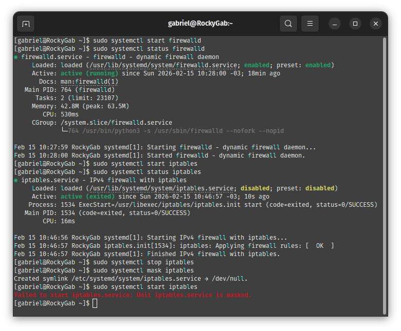
* **SELinux Proativo:** Gestão de contextos sem desativar a proteção do Kernel.
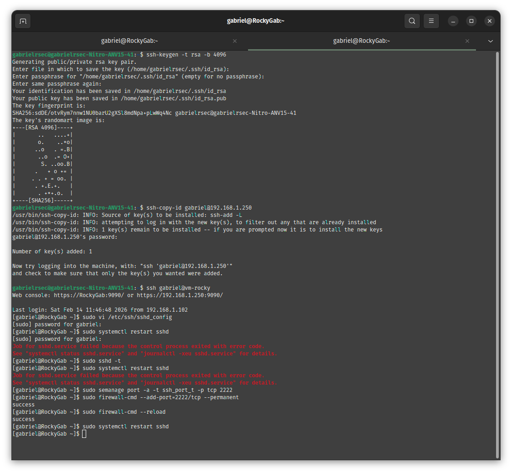

---

## 📂 Estrutura do Projeto
* `scripts/`: Toolkit de auditoria e monitoramento.
* `docs/assets/`: Evidências de hardening e relatórios de auditoria.

---
## ⏭️ Próxima Etapa
A segurança aqui estabelecida garante a integridade para as métricas e logs coletados no **[Repo 3: System Health & Observability](https://github.com/gabrielsystems-sec/system-observability-hub)**.
