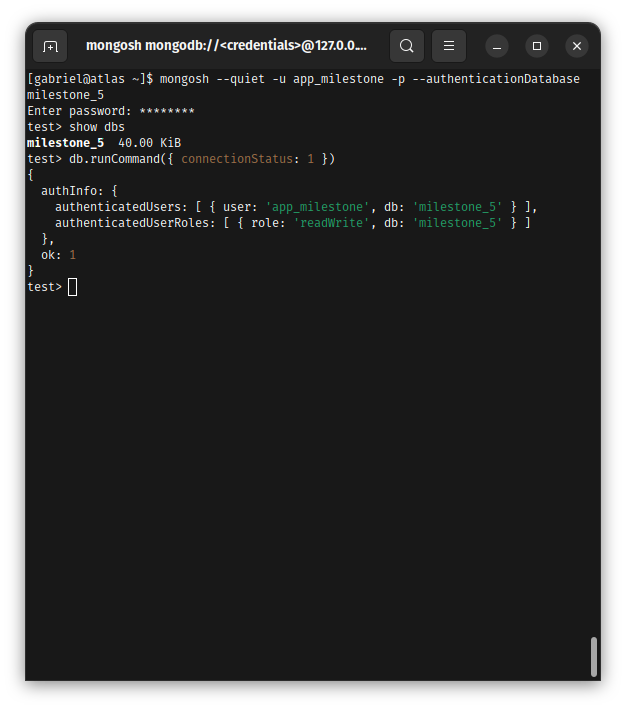
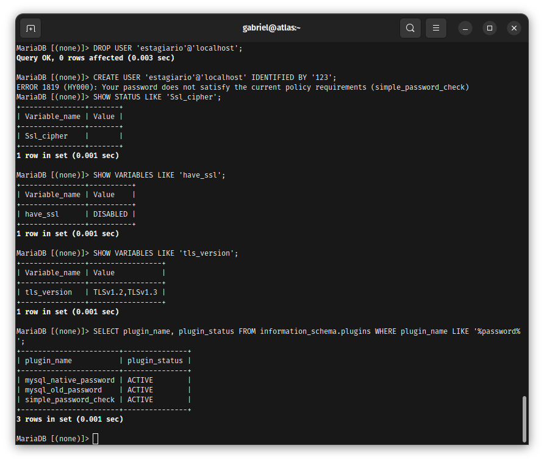
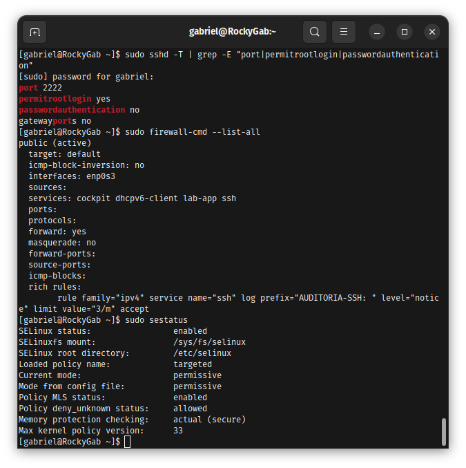
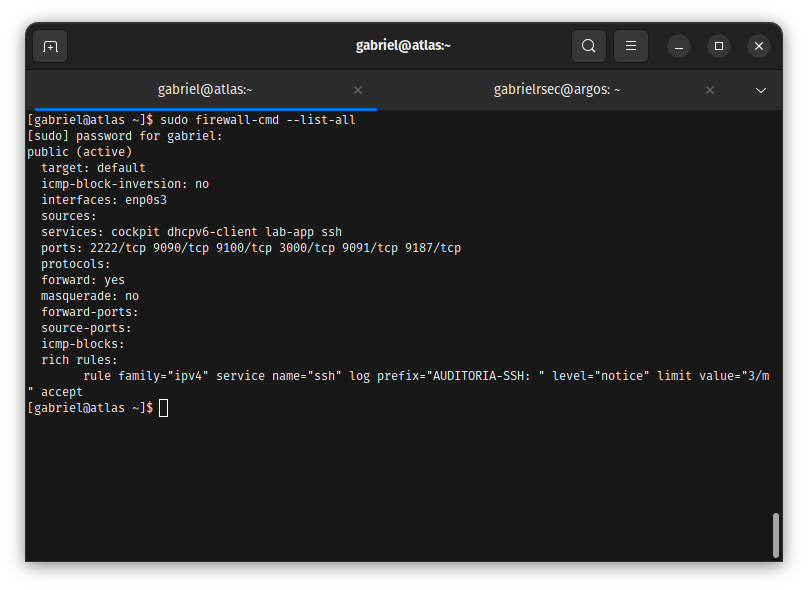
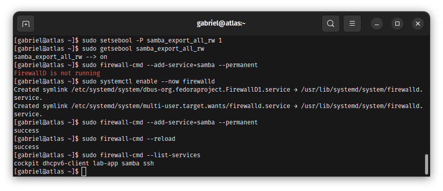
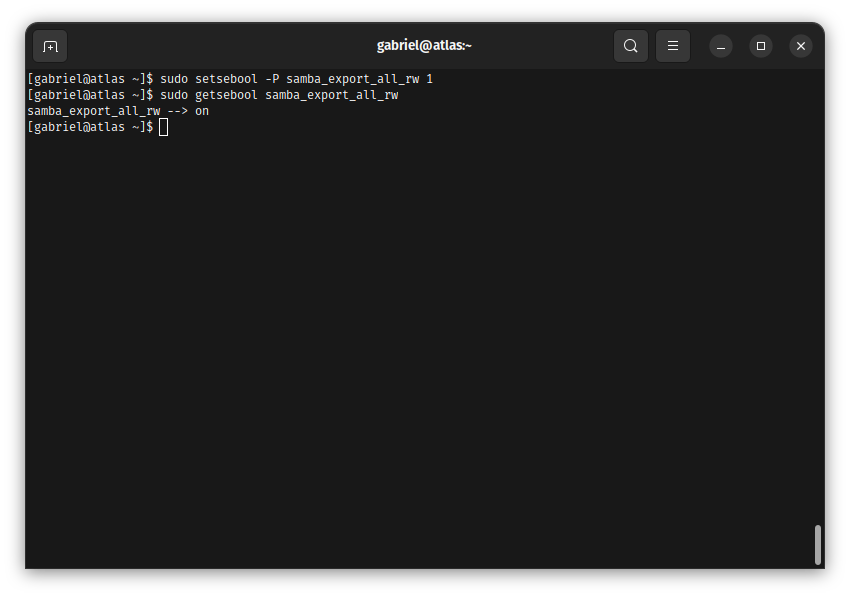
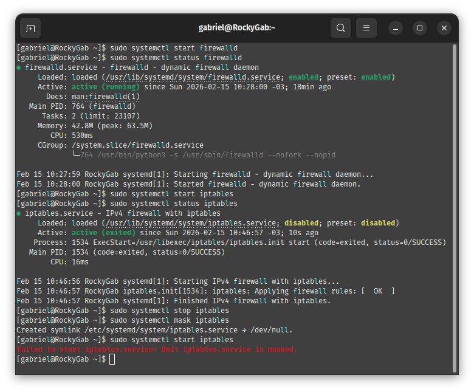

# Identity, Access & Cybersecurity 🛡️

> Hardening de sistemas RHEL-based, gestão de identidades (IAM) e defesa em profundidade.

| Categoria | Tecnologias | Status |
| :--- | :--- | :--- |
| **Segurança** | SELinux (Permissive), Tripwire | ✅ Stable |
| **Firewall** | Firewalld (Rich Rules), Fail2Ban | ✅ Ativo |
| **Criptografia** | LUKS (Data-at-Rest) | ✅ Implementado |
| **Auditoria** | Lynis (Hardening Index: 69) | ✅ Auditado |

---

## 🎯 Objetivo Técnico
Transformar um servidor padrão em uma infraestrutura resiliente e auditável, aplicando camadas de defesa em profundidade para proteção de dados e controle de acesso granular no Rocky Linux.

---

## 📁 1. Gestão de Identidade e Acesso (IAM)

### Contexto do Problema
Necessidade de centralizar a gestão de acessos administrativos, auditar sessões e aplicar permissões granulares no sistema de arquivos além do padrão RWX tradicional.

### Troubleshooting e Resolução
* **Solução Aplicada:** Implementação de controle de acesso via Cockpit unificado. Configuração de ACLs avançadas via `setfacl` e auditoria de sessões ativas via binários de accounting do sistema.

### Evidência Técnica

  
📂 Clique para ver o painel de IAM, ACLs e Auditoria de Sessão

  * **IAM Cockpit:** 
  * **Configuração de ACL:** 
  * **Auditoria de Sessão:** 
  * **RBAC Final (MongoDB/System):** 
  * **Password Policy (PAM/Shadow):** 

---

## 📁 2. Integridade e Detecção de Intrusão (FIM & Antivírus)

### Contexto do Problema
Garantir que binários do sistema operacional e arquivos de configuração críticos não sejam alterados por atores maliciosos (ataques de persistência).

### Troubleshooting e Resolução
* **Solução Aplicada:** Deploy do **Tripwire** para File Integrity Monitoring (FIM) e do **ClamAV** para varredura de malwares em tempo real. Submissão do host ao benchmark do Lynis atingindo o índice de Hardening 69.

### Evidência Técnica

  
📂 Clique para ver os relatórios do Lynis, Tripwire e ClamAV

  * **Lynis Hardening Index 69:** 
  * **Tripwire Integrity Check:** 
  * **ClamAV Status:** 

---

## 📁 3. Defesa de Perímetro e Análise de Ofensiva (SOC Mindset)

### Contexto do Problema
O serviço de SSH na porta padrão (22) sofria constantes tentativas automatizadas de brute force.

### Troubleshooting e Resolução
1. **Blindagem:** Migração do SSH para a porta não convencional `2222` e amarração do daemon `fail2ban` para banimento automático de IPs ofensores.
2. **SOC Mindset:** Monitoramento de logs via `journalctl` correlacionando eventos com a matriz MITRE ATT&CK (T1110 - Brute Force). Bloqueio de tráfego de borda via Rich Rules do Firewalld.
3. **Políticas de Transição:** Configuração de diretrizes para o SELinux e análise de logs de auditoria (avc: denied) para garantir que a transição para o modo Enforcing ocorra sem interrupção de serviços críticos.

### Evidência Técnica

  
📂 Clique para ver o Firewall, Fail2Ban e Detecção de Brute Force

  * **Auditoria de Hardening SSH:** 
  * **Jail do Fail2Ban Ativa:** 
  * **Firewalld Rich Rules:** 
  * **Captura de Brute Force (SOC):** 
  * **Network Whitelisting:** 
  * **Native Firewall Rules:** 
  * **SELinux Enforcement Policy:** 

---

## 📁 4. Resolução de Conflitos de Kernel (NVIDIA/CUDA)

### Contexto do Problema
Mismatch crítico entre bibliotecas de usuário NVML e os módulos do Kernel Linux carregados em tempo de execução para aceleração gráfica.

### Troubleshooting e Resolução
* **Causa Raiz:** Múltiplos repositórios conflitantes habilitados simultaneamente instalando versões dessincronizadas do driver proprietário.
* **Solução Aplicada:** Purge completo das bibliotecas antigas, saneamento da lista de repositórios do DNF e deploy limpo do Driver Open Kernel (v580) e Toolkit CUDA.

### Evidência Técnica

  
📂 Clique para ver a resolução de Kernel e o Setup CUDA

  * **Limpeza de Repos:** 
  * **Setup Final RTX/CUDA:** 

---

## 🤖 Automação de Auditoria e Saúde (Toolkit)

Desenvolvimento de scripts Bash para garantir a conformidade contínua do ambiente:

* **`security_audit.sh`**: Validação automatizada de conformidade de SELinux, SSH e Firewalld.
* **`check_system_health.sh`**: Diagnóstico proativo de saúde de hardware e swap.
* **`monitor_sistema.sh`**: Centralizador de logs e comportamento de processos suspeitos.

### Evidência Técnica

  
📂 Clique para ver a execução do Script de Monitoramento

  

---

## 🛡️ Diferenciais de Operação (Engenharia de Segurança)

### Compilação Manual (Nmap de Terceiros)
Domínio total do ciclo de vida de software, compilando binários direto do código-fonte para evitar dependências comprometidas de repositórios externos.

### SELinux Sem Desvios
Gestão proativa de contextos de segurança, tratando alertas de violação via audit2allow e semanage, garantindo que o sistema esteja preparado para o modo Enforcing sem a necessidade de desativar as proteções do Kernel.

### Evidência Técnica

  
📂 Clique para ver a compilação do Nmap, Mascaramento e SELinux

  * **Nmap Compilation Success:** 
  * **Service Masking:** 
  * **SELinux Context Resolution:** 

---

## ⏭️ Próxima Etapa
As políticas de segurança e rastreamento aqui estabelecidas garantem a integridade confiável para as métricas e logs coletados no **[Repo 3: System Health & Observability](https://github.com/gabrielsystems-sec/system-observability-hub)**.
